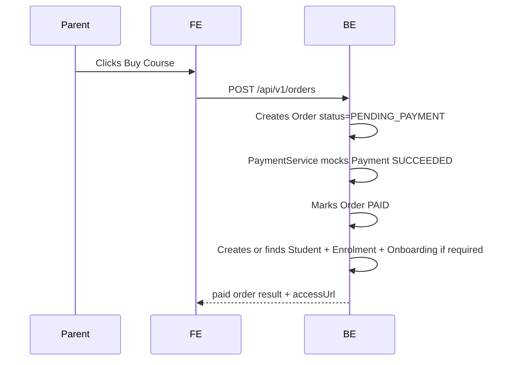
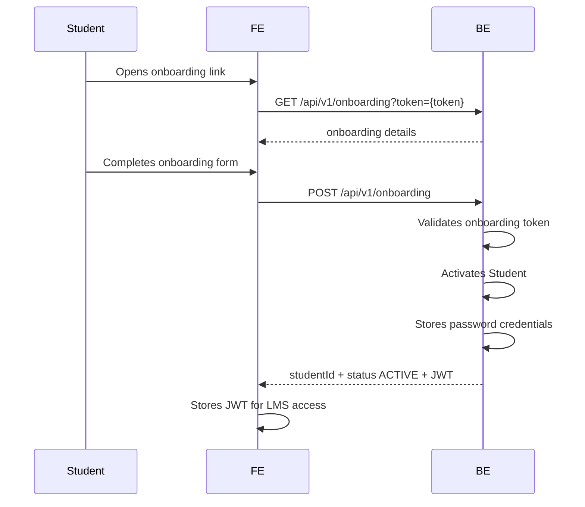
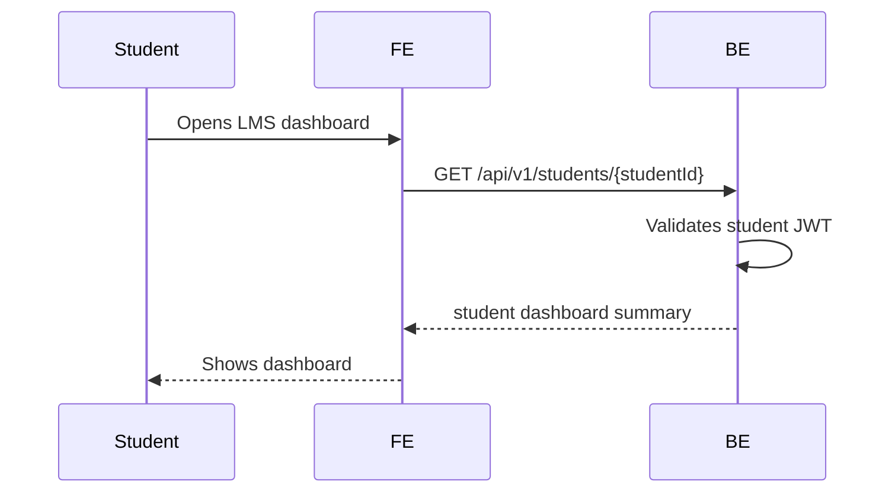
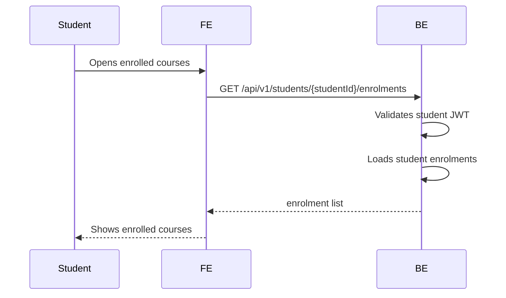
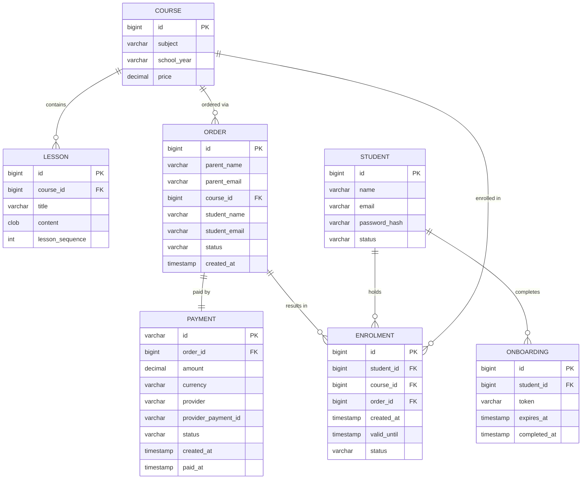

# Small web application that mocks the MES core user journey

## Quick start

```bash
docker compose up --build
```

After the first build, start normally without rebuilding:

```bash
docker compose up
```

## Services

- Backend: `http://localhost:8080`
- Frontend: `http://localhost:5173`

## Architecture overview
- React for frontend
- Java for backend 

Parent purchase flow

<details>


</details>

Student onboarding flow

<details>



</details>

LMS Dashboard
<details>



</details>

Display of enrolled courses
<details>



</details>

## ER Diagram


 
---

## API design

Main contracts:

- `GET /api/v1/courses`
- `GET /api/v1/courses/{courseId}`
- `POST /api/v1/orders`
- `GET /api/v1/onboarding?token={token}`
- `POST /api/v1/onboarding`
- `GET /api/v1/students/{studentId}`
- `GET /api/v1/students/{studentId}/enrolments`
- `GET /api/v1/enrolments/{enrolmentId}/lessons`
- `GET /api/v1/enrolments/{enrolmentId}/lessons/{lessonId}`

See `backend/README.md` for full endpoint documentation.

## Key technical decisions

- Some limitations - no parent is created, payment is mocked, the link url is for onboarding, it isn't a general link for the course and once accessed to decide if the user needs to be onboarded or not, there could be lots of improvements made to the product. Enrolment is created regardless if the user is connected to the course already. Enrolment needs to be unique. This is just an MVP.
- Domain driven design is followed. Modelling the domain was key for building the application and important step at the start. The backend follows modular, extensible architecture.
- There is no public payment controller or payment confirmation endpoint in the MVP. `OrderService` owns order completion and delegates mock payment creation to `PaymentService`.
- Onboarding is optional. It is created only when the resolved student is not already active. 
- The backend does not implement webhooks, payment intents, checkout sessions, refunds, retries, or the Stripe SDK.
- The frontend needs one checkout call: submit the checkout form to `POST /api/v1/orders`. The response always contains `accessUrl`; open or share that landing link.
- Simple h2 in-memory db is set up


# How LLM was used during development

LLM was used iteratively to design and build this project — from domain modelling through to a working full-stack application.

---

## 1. Domain Modelling

The first step was to model the system by identifying domain entities before writing any code.

### Initial Prompt

```
You are a pragmatic software architect and domain-driven design expert.

Analyse the following requirements and identify the minimum viable domain model
required to support the end-to-end journey.

Requirements: [functional requirements]

Constraints:
- Only identify concepts required to support the core flows.
- Do not provide any code in this step and do not build the application.

For each domain, provide:
- Name
- Purpose
- Key attributes
- Relationships

Also identify:
- Which objects are persistent
- Which objects can be derived or hard-coded

Return:
1. Core entities
2. Value objects (if any)
3. Simplified ER diagram in Mermaid format
4. Assumptions made
```

### Iteration

The initial output needed refinement. The LLM conflated the user flow with the domain model, and made several design decisions I challenged:

- **`INVITATION` → `Onboarding`** — Onboarding requires independent lifecycle tracking with its own statuses, so it warranted its own entity.
- **`Purchase` → `Order`** — "Purchase" describes an action, not a domain concept. The order captures the parent's intent, creates the student in an `INVITED` state, and onboarding transitions them to `ACTIVE`.
- **Missing `Enrolment`** — The LLM assumed students could discover their courses through `Order`, which introduces coupling and is inefficient for displaying a student's courses. `Enrolment` was introduced as a dedicated entity with its own lifecycle, decoupled from `Order`.
- **`Lesson` model** — The LLM was prompted to choose between two models: a shared catalogue item vs. a per-student individually generated lesson. For this MVP, lessons are static catalogue items that students simply access — no per-student lesson generation needed.

### Refinement Prompt

```
Step 1. Redefine the model to introduce an Onboarding entity. This will allow us
to track student onboarding and the status of the student along with the onboarding.
Onboarding requires independent lifecycle tracking. Introduce Order entity instead
of Purchase — the parent provides the student's details at checkout, the Order
creates the student in INVITED state, and onboarding completes the activation to ACTIVE.

Step 2. Lesson domain needs improvement. There are 2 ways to look at the lesson:
- A lesson as a reusable entity which exists independent of students, and the
  student's interaction with the lesson is tracked separately in a StudentLesson entity.
- OR, each student gets their own lesson, individually generated.
Should a Lesson be a shared catalogue item or an individual booking/session?
We are building a simple MVP — lessons already exist statically and are not
individually booked. Model accordingly.

Step 3. Introduce Enrolment as a separate entity. Students need to see their enrolled
courses. This connection should be efficient and avoid unnecessary joins.

Step 4. Create an ER diagram in a .md file.
```

### Initial vs. Final Entities

| Initial | Final                    |
|---|--------------------------|
| `Parent` | `Removed - out of scope` |
| `Purchase` | `Order`                  |
| `Invitation` | `Onboarding`             |
| `Student` | `Student`                |
| `Course` | `Course`                 |
| `Lesson` | `Lesson`                 |
| `LessonProgress` | `Enrolment`              |
---

## 2. API Contracts

With the domain model in place, API contracts were generated next.

### Prompt

```
Step 1. Define API contracts/endpoints using the [domain model] and
[functional requirements].

Step 2. Output the API endpoints — do not use OpenAPI specification format.
```

### Output
Initial API Contracts
- `GET /courses`
- `GET /courses/{courseId}`
- `POST /orders`
- `GET /onboarding/:studentId`
- `POST /onboarding/:studentId/activate`
- `GET /lms/dashboard`
- `GET /lms/lessons`
- `GET /lms/lessons/:lessonId`

### Manual Adjustments

- Removed `/lms/` from all resource paths — it was not a valid or meaningful path prefix for these endpoints.
- Decided **not** to create a `Parent` entity in this MVP. Billing history, parent login, and parent-level tracking are out of scope. A `Parent` entity should be introduced in a later iteration if needed.

---

## 3. Backend — Java & Spring Boot

Once the API contracts were defined, the backend was scaffolded in a single prompt.

### Prompt

```
Step 1. Build simple app with Java and Spring Boot following Domain Driven Design.

Step 2. Use the ER diagram of our domain model, the described functional
requirements, and the API endpoints, implement the backend adhering to DDD design
and architecture for the codebase structure. Keep clarity and simplicity — do not
introduce new concepts that were not requested.

[ Insert ER Diagram ]

Implement:
- API endpoint controllers
- Controller advice
- Services
- H2 in-memory database
- Spring JPA
- Seed data via Liquibase
- Simple authentication for private endpoints, no auth for public endpoints
- Documented controllers, methods, and classes
- Unit and integration tests using given/when/then style
- Test data for mock tests
- Observability: appropriate logging and error handling
- Meaningful error messages in controller advice without leaking business logic
```

---

### Manual Adjustments
I reviewed the proposed implementations and made adjustments to the codebase where necessary, since the app had problems extracting services properly at first go.

## 4. Frontend — React & TypeScript

The frontend was built to match the API contracts and cover the required flows.

### Prompt

```
Build a simple React + TypeScript frontend using Vite for an MVP LMS
purchase/onboarding flow. Output it in a zipped file.

Use:
- React
- TypeScript
- React Router
- Material UI
- React Testing Library + Vitest
- Best practices: typed API client, route constants, reusable layout,
  small components, clear loading/error states, no unnecessary complexity.

[API contracts]

Deliverables:
- Typed API client in src/api/client.ts
- TypeScript types in src/api/types.ts
- React Router routes in src/router.tsx
- ProtectedRoute component checking localStorage for token and studentId
- Material UI components for layout, cards, forms, buttons, alerts, loading states
- Simple styling
- Clear error handling for failed API calls

Tests:
- Courses list renders and buy button navigates
- Checkout submits order and opens the shared access link returned by checkout
- Onboarding submits and stores JWT/studentId
- Protected dashboard redirects when unauthenticated
- Dashboard loads when authenticated
- Lesson list renders
- Lesson detail renders

Mock all API calls. Keep tests simple but meaningful.

Output a complete project structure with all source files, package.json
scripts, and test setup.
```
